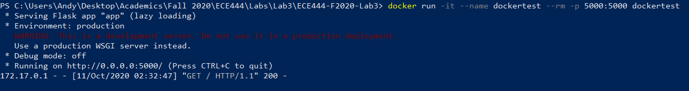
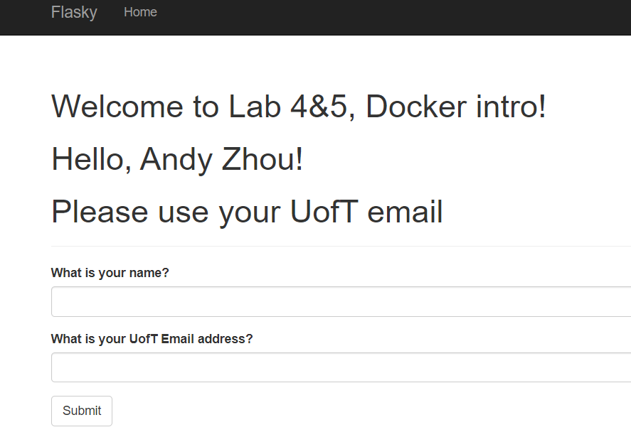
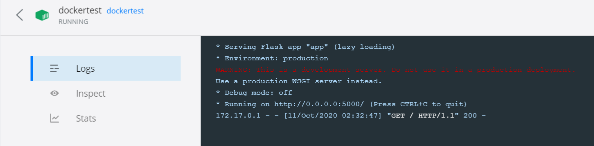

Andy L. Zhou
&nbsp;

Lab 4&5 Docker
## Instructions
Steps to run Flask app user docker

1. Build the docker image using the Dockerfile using the command

docker build --tag=dockertest .

2. Run docker file and route the app to port 5000 using the command

docker run -it --name dockertest --rm -p 5000:5000 dockertest

3. Go to the url http://127.0.0.1:5000/ on your browser and you will see the app

## Screenshots:

## Activity 3:
Although docker containers resemble VMs in their ability to simulate an isolated operating environment, 
they have significant differences.
1. Docker containers are lightweight and can be created in seconds while VMs can take a while to build.
2. Docker containers are smaller kb/mb and use less resources (ram, cpu) compared to VMs which can be in
the GBs and use more hardware resources.
3. In docker, multiple containers can run with one host operating system (less isolation), where in a VM environment we
need a completely separate and isolated operating system for each VM (more isolation).

 
