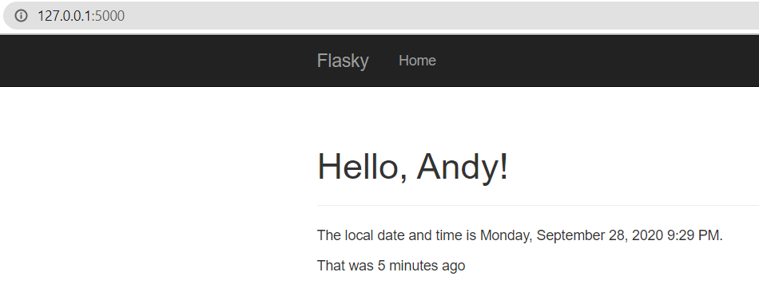
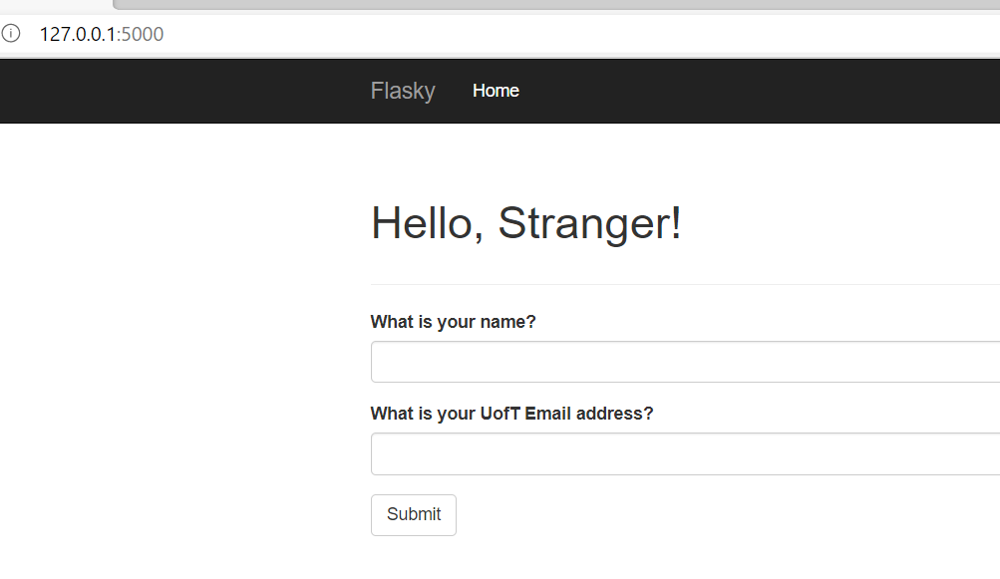
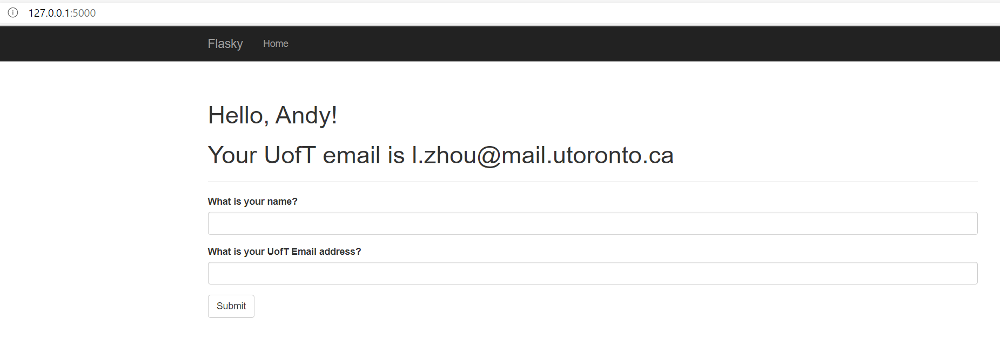

Andy L. Zhou
&nbsp;

this repo is a clone of https://github.com/miguelgrinberg/flasky

## Activity 1:

## Activity 2:

## Activity 3:
SQL databases are relational databases where data is stored in tables of fixed columns 
and rows defined by the schema and can be queried using SQL. NoSQL databases refer to non-relational databases 
and include document databases, key-value stores, wide-column stores, and graph databases.
Document databases for example support fields and objects (like a JSON object) for each record of data. 

 
